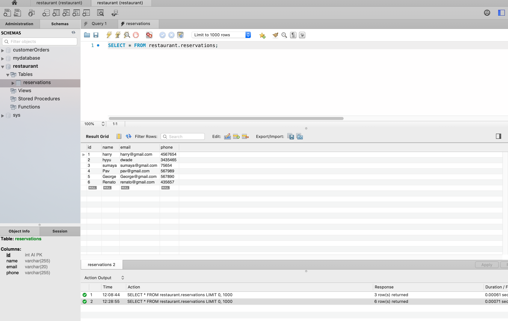

# Hot Restaurant Mini Project

A restaurant booking app was created using node js, mysql and express. Our team was split into two teams one focusing on the front-end and the other team focusing on the backend.

# Project Description
The backend and frontend team worked together to produce a fully functional restaurant booking app. The front end focused on the ui aspect of the website giving it a clean, polished and easy to use appearance. Whereas the backend focused on retrieving the information that had come from each customer and created functions that would save the data in a database using node js, express js and mysql. Customers were split into two tables, the first five customers are allocated to a table were they will be seated straight away any additional customers are allocated to a waitlist table. 

# Installation

1. Clone the repository 
2. Write $npm init on the command line to get the package.json file
3. Run npm i to install all the dependencies for this project
4. On the command line run $node server.js
5. Go to the browser and search for localhost:3000
6. Finally book your reservation  

# Contributions
Constributions are welcome

# Test
Non required

# Lisense